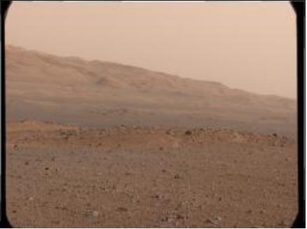
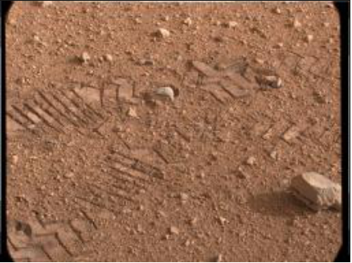
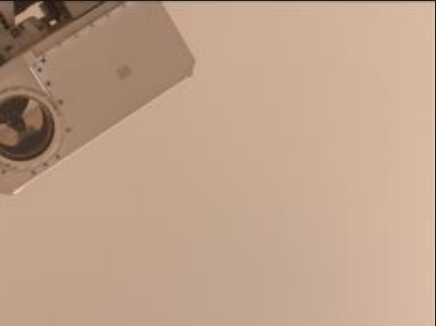
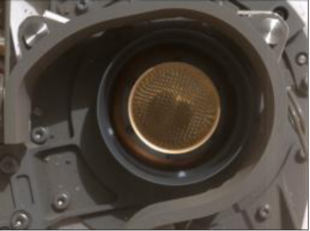
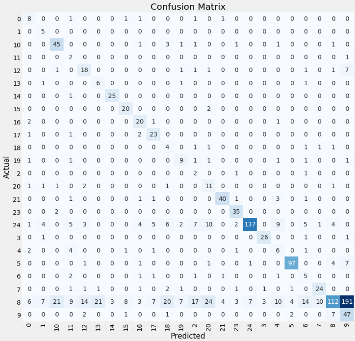
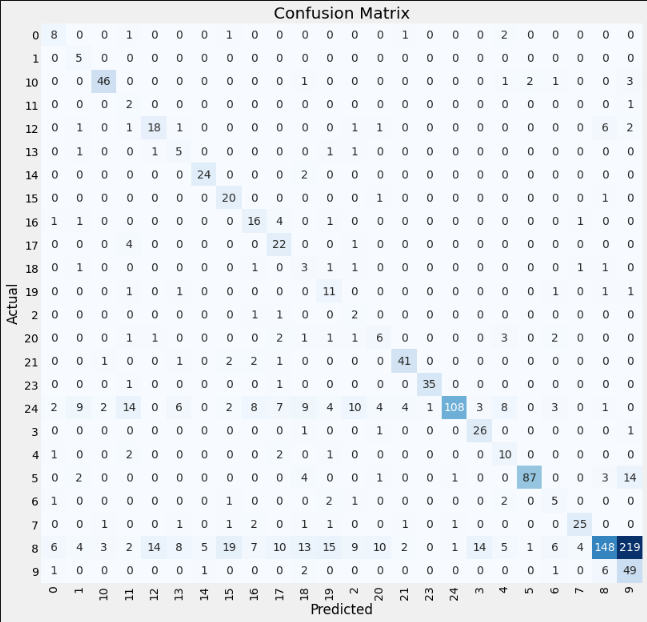
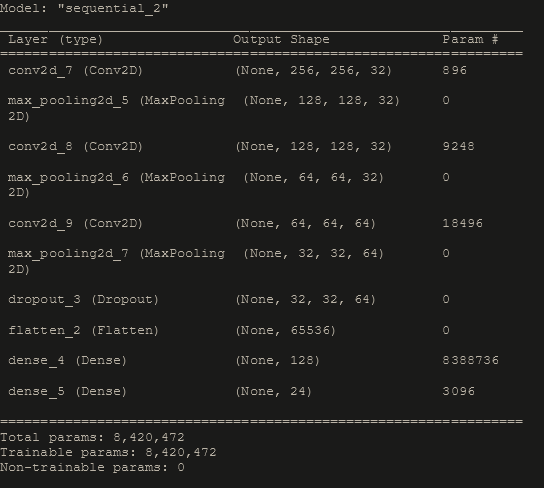
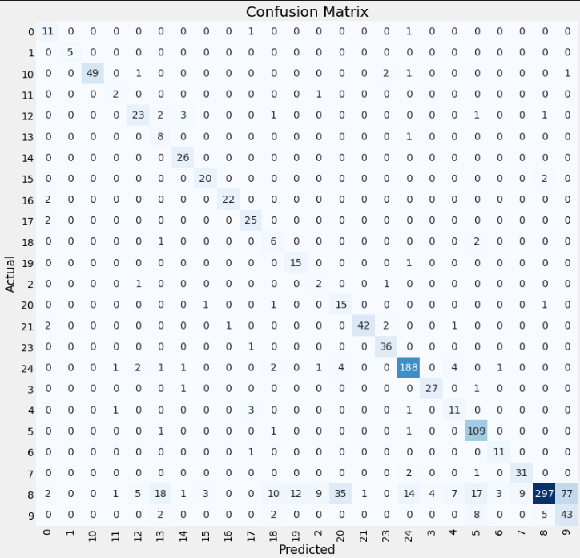
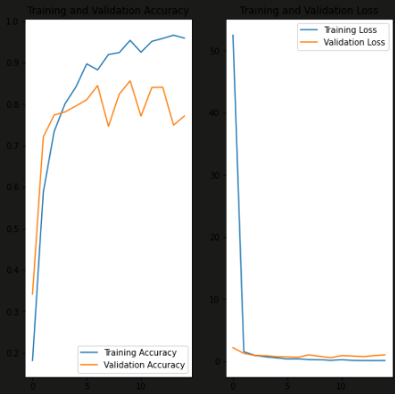
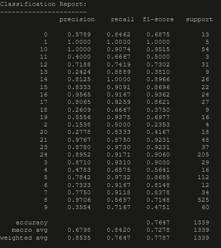

# Mars-Curiosity-Rover-Image-Classification-Project
Image Classification on Mars with 24 different classes

## Overview 

This is Image Classification project about Mars curiosity rover. Contains 6691 images collected 2012 to 2015. In this project, NASA or any other space companies who work on mars can find image classification model about mars. This could help the business to deploy our machine learning model on the future rovers to make better and better decisions by itself. NASA has two future missions shows on website; first Mars Sample Return, second ExoMars 2022 Rover and Surface Platform. Our model could deploy on that missions.

## Business Problem

Our aim is in this project is to image classification about Mars. Images collected by Curiosity Rover which launched Nov. 26, 2011 and landed on Mars at Aug. 5, 2012.
Curiosity set out to answer the question: Did Mars ever have the right environmental conditions to support small life forms called microbes? We are going to classify images collected by curiosity rover to help future projects. Our aim to make machine learning model and deploy at the future rovers to make future rover more effective decisions with artificial intelligence depend on mission.

## Dataset

The dataset provided on https://www.kaggle.com/datasets/brsdincer/mars-surface-and-curiosity-image-set-nasa .

Dataset set consists of 6691 images about Mars and rover's itself. Images collected between August 2012 to July 2015. Images are 24 different categories includes horizon , surface and rover's instruments(like cameras, sensors, chemistry tools etc.). We can see some them at below.

## Horizon

## Surface

## MASTCAM

The Mast Camera, or Mastcam for short, takes color images and color video footage of the Martian terrain. The images can be stitched together to create panoramas of the landscape around the rover.

## CHEMIN

The Chemistry and Mineralogy instrument, or CheMin for short, performs chemical analysis of powdered rock samples to identify the types and amounts of different minerals that are present.

## Modeling 

The main metric that I would be using to assess my models performance is `f-1 score`. F-1 score explain how good the quality of predictions are and how completely we've predicted labels from dataset. We wouldn't look at accuracy score because it would be misleading for our specific project. Because accuracy generally good for balanced classes and if every classes importances the same. We are goin to look at F-1 Score because it is harmonic mean of precision and recall scores what exactly need for this project. Which is for this project every class important for us.

### First Model

    First model f-1 score is %54.29 .
    

### Second Model 

    Second model f-1 score is %53.92 .
    
### Third Model

    Last model f-1 score is %76.47 .
